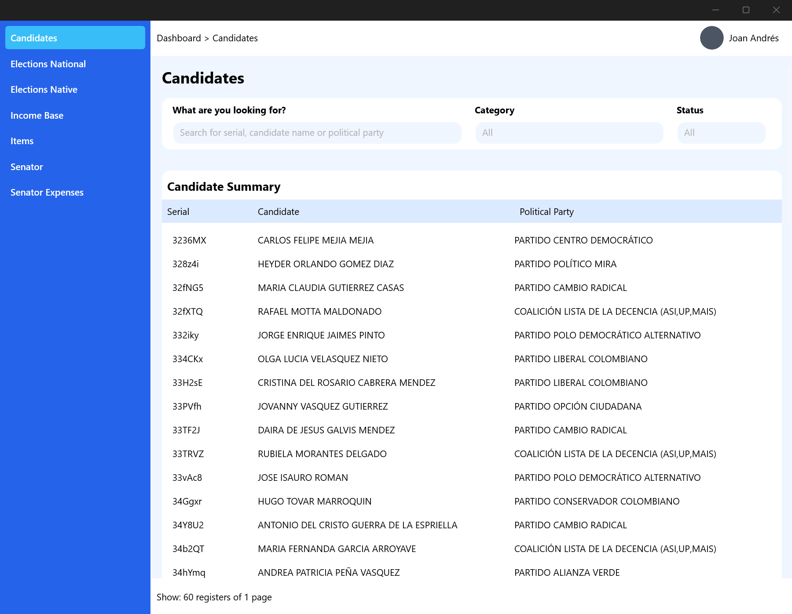

### Elections API

This project is a simple example of a REST API built with FastAPI.
It exposes a few endpoints for creating, reading, updating, and deleting users.

### Installation

To install the project, you will need to have Python 3.6+ installed.
Once you have Python installed, you can install the project dependencies
with the following command:

`pipenv install`

This will create a virtual environment and install the project
dependencies into it. You can then activate the virtual environment
with the following command:

`pipenv shell`

## Running the Project

To run the project, you can use the following command:

`uvicorn main:app --reload`

This will start the API server on port 8000. You can then test the
API endpoints by using a tool like Postman or curl.

### Running the Linter

This project use Ruff (Python linter, written in Rust)

`ruff check .`

### Documentation

The API documentation is generated automatically and can be accessed
at the following URL:

http://localhost:8000/docs